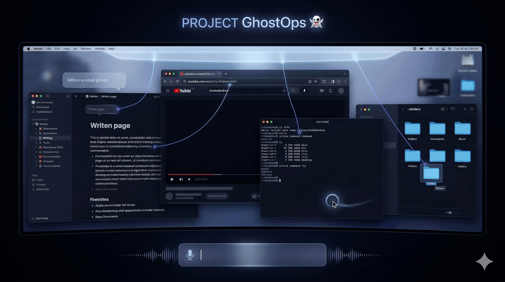

<div align="center">




# 👻 GhostOps

### *Your invisible AI co-pilot. It sees your screen, learns your workflows, and acts on your behalf.*

[](https://ai.google.dev)
[](https://cloud.google.com)
[](https://electronjs.org)
[](https://python.org)
[](https://ai.google.dev)
[](LICENSE)

---

> **Built for the [Gemini Live Agent Challenge 2026](https://devpost.com) — UI Navigator category**
> A transparent, always-on desktop overlay powered by multimodal AI that sees, hears, speaks, and acts.

</div>

---

## ✨ What is GhostOps?

GhostOps is a **transparent Electron overlay** that sits invisibly above every window on your desktop. Press one shortcut and it appears — ready to answer questions, annotate your screen, control your computer, automate browser tasks, or **learn and replay your entire workflows**.

It's not a chatbot in a window. It *is* the window.

```
You press ⌘+Shift+Space
         │
         ▼
  ┌──────────────────────────────────────┐
  │  👻  Hey Kanishkha — what do you need? │  ← floating over your real screen
  └──────────────────────────────────────┘
         │
  You type: "watch me set up this repo"
         │
         ▼
  GhostOps records every action you take
  Then replays it perfectly on any machine
```

---

## 🎬 Demo

> **[▶ Watch the 4-minute demo video](#)** — Screen annotation → CLI control → Mouse automation → Workflow learning

---

## 🏗️ Architecture

```
┌─────────────────────────────────────────────────────────────────────────┐
│                         USER'S DESKTOP                                  │
│                                                                         │
│  ┌──────────────────────────────────────────────────────────────────┐   │
│  │               ELECTRON OVERLAY  (always on top)                  │   │
│  │  • Transparent, focusable-on-demand panel                        │   │
│  │  • Canvas: bounding boxes, dots, annotation text                 │   │
│  │  • Command bar: text input + voice mic + drag handle             │   │
│  │  • Status bubbles: real-time task progress                       │   │
│  └─────────────────────┬────────────────────────────────────────────┘   │
│                        │  WebSocket (ws://127.0.0.1:PORT)               │
└────────────────────────┼────────────────────────────────────────────────┘
                         │
┌────────────────────────▼────────────────────────────────────────────────┐
│                    PYTHON CORE  (app.py)                                │
│                                                                         │
│  ┌─────────────────────────────────────────────────────────────────┐   │
│  │                    GEMINI 2.5 FLASH ROUTER                      │   │
│  │  gemini-2.5-flash → decides which agent handles the task        │   │
│  │                                                                 │   │
│  │  ┌──────────┐ ┌──────────┐ ┌──────────┐ ┌──────────┐          │   │
│  │  │ direct   │ │ screen   │ │  cua_    │ │ browser  │          │   │
│  │  │ response │ │annotator │ │  vision  │ │  agent   │          │   │
│  │  └──────────┘ └──────────┘ └──────────┘ └──────────┘          │   │
│  │  ┌──────────┐ ┌──────────┐                                     │   │
│  │  │ cua_cli  │ │workflow  │  ← record/replay engine             │   │
│  │  └──────────┘ └──────────┘                                     │   │
│  └─────────────────────────────────────────────────────────────────┘   │
│                                                                         │
│  ┌──────────────────┐    ┌──────────────────────────────────────────┐  │
│  │  Gemini 2.5      │    │  Google Cloud                            │  │
│  │  Flash Vision    │    │  ├─ Firestore  (session memory)          │  │
│  │  (screen see)    │    │  ├─ Cloud Run  (backend API)             │  │
│  └──────────────────┘    │  └─ Gemini 2.5 Flash (voice/vision)     │  │
│                          └──────────────────────────────────────────┘  │
└─────────────────────────────────────────────────────────────────────────┘
```

---

## 🚀 Feature Overview

| Feature | Description | Shortcut / Command |
|---|---|---|
| 🧠 **Direct Q&A** | Instant answers without any agent | *"what is 42 × 37"* |
| 🔍 **Screen Annotation** | Floating bounding boxes over live UI | *"what's on my screen"* |
| 🖱️ **Computer Use** | Sees screen → moves cursor → clicks | *"click the new note button"* |
| ⌨️ **CLI Control** | Shell commands, file ops, open apps | *"open notion"* |
| 🌐 **Browser Agent** | Full Playwright web automation | *"search google for X"* |
| 📸 **Screen Context** | Reads screen then acts on what it sees | *"open this repo in Cursor"* |
| 🎙️ **Voice Input** | Whisper STT via mic button | Click 🎤 in overlay |
| 🔁 **Workflow Record** | Watch user → extract steps | *"watch me"* |
| ▶️ **Workflow Replay** | Replay saved workflows via vision | *"replay my-workflow"* |
| 💾 **Memory** | Firestore session memory across restarts | Auto on startup |
| 🎨 **Personalized** | Name-aware, personality-driven responses | `settings.json` |

---

## 🧠 Agent Routing

Every input is routed by **Gemini 2.5 Flash** to the right specialist:

```
User Input
    │
    ▼
┌─────────────────────────────────────────────────────┐
│           ROUTER (Gemini 2.5 Flash)                 │
└──┬──────────┬──────────┬──────────┬──────────┬──────┘
   │          │          │          │          │
   ▼          ▼          ▼          ▼          ▼
direct    screen      cua_cli   cua_vision  browser
response  annotator   (shell)   (mouse+KB)  (playwright)
   │          │          │          │          │
   │     bounding    open -a    go_to_     navigate
   │      boxes      Notion     element    click
   │     + labels    git clone  click_left fill form
   ▼          │      ls ~/      type_str   submit
 answer   overlay       │          │          │
          text     terminal   cursor      chrome
                   output     moves
```

---

## 🔁 Workflow Engine

The standout feature. GhostOps **watches you work** and learns to replicate it:

```
RECORD                           EXTRACT                      REPLAY
──────                           ───────                      ──────
User: "watch me"                 Last frame → Gemini          For each step:
  │                              vision →                       │
  ▼                              JSON steps:                    ▼
Screenshot every 2s              [{                          VisionAgent.execute(
  +                                action: "click",           "click the New Page
  voice transcription              target: "New Page btn",     button"
  captured into frames             value: ""                 )
  │                              }, ...]                        │
  ▼                                  │                          ▼
User: "remember this             Saved to                   Screenshot →
  as new-page"                   Firestore +                find element →
                                 local cache                move cursor →
                                                            click →
                                                            verify → next step
```

---

## 📦 Installation

### Prerequisites

| Requirement | Version |
|---|---|
| macOS | 12+ (Monterey or later) |
| Python | 3.13+ |
| Node.js | 18+ |
| uv | latest |

### 1. Clone the repo

```bash
git clone https://github.com/yourusername/ghostops.git
cd ghostops
```

### 2. Set up Python environment

```bash
# Install uv if you don't have it
curl -LsSf https://astral.sh/uv/install.sh | sh

# Create venv and install dependencies
uv venv .venv --python 3.13
source .venv/bin/activate
uv pip install -r requirements.txt
```

### 3. Install Electron dependencies

```bash
cd ui
npm install
cd ..
```

### 4. Configure environment

```bash
cp .env.example .env
```

Edit `.env` and fill in your keys:

```env
# Required
GEMINI_API_KEY=your_gemini_api_key_here
GOOGLE_CLOUD_PROJECT=your_gcp_project_id

# Optional
ELEVENLABS_API_KEY=your_elevenlabs_key   # for voice output
CLOUD_RUN_URL=https://your-service.run.app  # for persistent memory
FIRESTORE_SESSION_ID=your_username
```

> 💡 **Get your keys:**
> - Gemini: [aistudio.google.com](https://aistudio.google.com) → Get API Key
> - GCP: [console.cloud.google.com](https://console.cloud.google.com) → create project

### 5. Personalize (optional but recommended)

Edit `settings.json`:

```json
{
  "user_name": "YourName",
  "agent_name": "GhostOps",
  "personalization": "Be concise and slightly witty. You know your user prefers terminal over GUI."
}
```

### 6. Grant macOS permissions

GhostOps needs screen recording and accessibility access:

1. **System Settings → Privacy & Security → Screen Recording** → add Terminal + Electron
2. **System Settings → Privacy & Security → Accessibility** → add Terminal + Electron
3. **System Settings → Privacy & Security → Microphone** → add Electron (for voice input)

### 7. Run GhostOps

Open **two terminals**:

**Terminal 1 — Python backend:**
```bash
source .venv/bin/activate
python app.py
```

**Terminal 2 — Electron overlay:**
```bash
cd ui
npm run dev
```

You should see:
```
Models loaded - Rapid: gemini-2.5-flash, GhostOps: gemini-2.5-flash
Visualization server listening at ws://127.0.0.1:XXXX
Overlay client connected.
```

---

## 🎮 Usage

### Keyboard Shortcuts

| Shortcut | Action |
|---|---|
| `⌘ + Shift + Space` | Show/hide the command overlay |
| `⌘ + Shift + C` | Stop all running tasks immediately |
| `⌘ + Shift + M` | Toggle TTS mute |
| `Escape` | Dismiss overlay |
| `Enter` | Submit command |

### Command Examples

**💬 Direct answers**
```
"what's the square root of 144"
"what time zone is Tokyo in"
"explain what a webhook is"
```

**🔍 Screen annotation**
```
"what's on my screen"
"explain what I'm looking at"
"what does this button do"
"point to the settings icon"
```

**⌨️ CLI tasks**
```
"open notion"
"create a folder called projects on my desktop"
"list my downloads folder"
"what's my local IP address"
"check if git is installed"
```

**🖱️ Computer use** *(app must be open)*
```
"click the new note button"
"type hello world in the search bar"
"click settings in the menu"
"calculate 18% tip on $84 using the calculator"
```

**🌐 Browser automation**
```
"search google for best coffee shops near me"
"go to github.com and search for electron"
"open youtube and search for lofi music"
```

**📸 Screen context** *(reads what's on screen first)*
```
"open this repo in Cursor"
"run the dev server I can see"
"clone and run this project"
```

**🔁 Workflow learning**
```
# Start recording
"watch me"

# Do your workflow manually (GhostOps records every 2 seconds)
# Open an app, fill a form, set up a project...

# Save it
"remember this as setup-project"

# Replay any time
"replay setup-project"
```

---

## 🗂️ Project Structure

```
ghostops/
│
├── 📄 app.py                        ← Main entry point
├── ⚙️  settings.json                 ← User config (name, personality, models)
├── 🔑 .env                          ← API keys (never committed)
│
├── 🤖 agents/
│   ├── screen/                      ← Screen annotation (bounding boxes + labels)
│   │   ├── agent.py
│   │   ├── tools.py                 ← draw_bounding_box, draw_text, etc.
│   │   └── prompts.py
│   │
│   ├── cua_vision/                  ← Computer use (sees screen → clicks)
│   │   ├── agent.py                 ← VisionAgent
│   │   ├── single_call.py           ← Gemini vision execution loop + loop detection
│   │   ├── tools.py                 ← go_to_element, click, type_string, etc.
│   │   └── prompts.py
│   │
│   ├── cua_cli/                     ← Shell agent (subprocess execution)
│   │   └── agent.py                 ← CLIAgent, runs shell commands safely
│   │
│   ├── browser/                     ← Browser automation (Playwright + browser-use)
│   │   └── agent.py
│   │
│   └── workflow/                    ← Record + replay engine
│       └── engine.py                ← start_recording, stop_and_save, replay
│
├── 🧠 models/
│   ├── models.py                    ← Gemini 2.5 Flash router + agent dispatch
│   ├── function_calls.py            ← Tool declarations for all 6 routes
│   └── prompts.py                   ← Personalized system prompts
│
├── 🎙️  voice/
│   └── live_api.py                  ← Gemini Live API voice session
│
├── 🖥️  ui/
│   ├── main.js                      ← Electron main process
│   ├── renderer.js                  ← Canvas rendering + WebSocket client
│   ├── preload.js                   ← IPC bridge
│   ├── index.html                   ← Overlay HTML
│   ├── animations/
│   │   ├── command_overlay.js       ← Input bar, drag, voice mic
│   │   ├── command_overlay.css
│   │   ├── status_bubble.js         ← Task progress indicator
│   │   └── screen_glow.js
│   └── dom_nodes/
│       ├── overlay_text.js          ← Draggable AI response bubbles
│       └── overlay_box.js           ← Annotation box elements
│
├── 🔧 core/
│   ├── settings.py                  ← Read/write settings.json
│   ├── gemini_provider.py           ← Gemini text + vision + audio (STT)
│   └── registry.py                  ← Shared overlay state
│
├── 🖼️  desktop/
│   └── screen.py                    ← Screenshot capture (PIL/mss)
│
├── 🔗 integrations/
│   └── audio/
│       └── tts.py                   ← ElevenLabs TTS
│
├── ☁️  backend/
│   ├── main.py                      ← FastAPI backend (Cloud Run)
│   └── memory.py                    ← Firestore memory read/write
│
└── 🚀 deploy/
    └── deploy.sh                    ← One-command Cloud Run deployment
```

---

## ☁️ Cloud Deployment

GhostOps uses **Google Cloud Run** for the persistent backend (memory, workflow storage) and **Firestore** for session data.

### Deploy the backend

```bash
# Authenticate
gcloud auth login
gcloud config set project YOUR_PROJECT_ID

# Enable required APIs
gcloud services enable run.googleapis.com firestore.googleapis.com aiplatform.googleapis.com

# Deploy in one command
bash deploy/deploy.sh
```

After deployment, copy the Cloud Run URL into your `.env`:
```env
CLOUD_RUN_URL=https://ghostops-backend-xxxx-uc.a.run.app
```

### Firestore collections

| Collection | Purpose |
|---|---|
| `sessions/{id}/turns` | Conversation memory per user |
| `workflows/{name}` | Saved workflow steps |

---

## 🔬 How the Vision Loop Works

When GhostOps performs a computer-use task (clicking, typing, navigating), this is the per-step loop:

```
┌─────────────────────────────────────────────────────────────┐
│                    SINGLE CALL VISION ENGINE                │
└───────────────────────────┬─────────────────────────────────┘
                            │
            ┌───────────────▼───────────────┐
            │  1. Capture screenshot         │
            │     (active window or full)    │
            └───────────────┬───────────────┘
                            │
            ┌───────────────▼───────────────┐
            │  2. Send to Gemini 2.5 Flash   │
            │     with task + tool schema    │
            └───────────────┬───────────────┘
                            │
            ┌───────────────▼───────────────┐
            │  3. Model returns tool calls:  │
            │     go_to_element(bbox)        │
            │     click_left_click()         │
            │     type_string("hello")       │
            │     press_ctrl_hotkey("s")     │
            │     task_is_complete()         │
            └───────────────┬───────────────┘
                            │
            ┌───────────────▼───────────────┐
            │  4. Execute tool calls         │
            │     (pyautogui / subprocess)   │
            └───────────────┬───────────────┘
                            │
            ┌───────────────▼───────────────┐
            │  5. Loop detection:            │
            │     same action ×3 → stop      │
            │     same click ×5 → fallback   │
            └───────────────┬───────────────┘
                            │
                     task_is_complete?
                      YES ──┘  NO → back to step 1
```

---

## 🛠️ Tech Stack

| Layer | Technology | Why |
|---|---|---|
| **Overlay UI** | Electron + HTML Canvas | Transparent, always-on-top, cross-workspace |
| **IPC** | WebSocket (Python ↔ Electron) | Low-latency bidirectional drawing commands |
| **Router LLM** | Gemini 2.5 Flash | Fast multimodal routing decisions |
| **Vision LLM** | Gemini 2.5 Flash | Multimodal screen understanding + tool calling |
| **Voice** | Gemini Live API (2.5 Flash) | Real-time streaming audio, lowest latency |
| **Browser** | Playwright + browser-use | Reliable cross-browser automation |
| **Screenshot** | PIL ImageGrab + mss | macOS-native, low overhead |
| **Mouse/KB** | pyautogui | Cross-platform desktop control |
| **Memory** | Google Cloud Firestore | Real-time, serverless, persistent |
| **Backend** | FastAPI on Cloud Run | Auto-scaling, no cold starts |
| **STT** | Gemini Audio / Web Speech API | Fast, accurate, on-demand transcription |
| **TTS** | ElevenLabs (optional) | Natural voice output |

---

## ⚡ Model Usage

| Model | Used For | Notes |
|---|---|---|
| `gemini-2.5-flash` | Routing decisions + vision + screen understanding | Primary model for all agent tasks |
| `gemini-2.5-flash` | Voice sessions (Live API) | Real-time bidirectional audio |
| `gemini-2.5-flash` | Workflow step extraction | Multimodal screenshot analysis |

> 💡 To use Vertex AI instead of the API key (recommended for production / unlimited quota):
> ```python
> # In models/models.py:
> self.client = genai.Client(vertexai=True, project="your-project", location="us-central1")
> ```

---

## 🔒 Security & Privacy

- **No data leaves your machine** except API calls (Gemini, Firestore)
- Screenshots are captured in-memory and sent directly to the model — never written to disk
- `.env` is gitignored — API keys are never committed
- The overlay window is `focusable: false` by default — it doesn't steal keyboard focus until you summon it
- All shell commands run as your user — no privilege escalation

---

## 🐛 Troubleshooting

**Overlay doesn't appear**
```bash
# Check Python server is running
python app.py  # should print "Overlay client connected"
```

**"Rate limit exceeded" errors**
> Switch to Vertex AI for higher quota using your GCP credits (see Model Usage section above).

**Mouse clicks land in wrong place**
> Ensure macOS Accessibility permission is granted for Terminal and the Electron app.

**No audio from voice input**
> Check microphone permission in System Settings → Privacy → Microphone → allow Electron.

**Firestore writes failing**
> Either deploy the backend (`bash deploy/deploy.sh`) or set `CLOUD_RUN_URL=http://localhost:8080` and run the backend locally.

---

## 🗺️ Roadmap

- [ ] **Vertex AI integration** — unlimited vision quota via GCP credits
- [ ] **Playwright browser recording** — record browser workflows, not just desktop
- [ ] **Proactive heartbeat** — agent checks in on you periodically (Cloud Scheduler)
- [ ] **Multi-user sessions** — per-user Firestore isolation with auth
- [ ] **Windows support** — pyautogui + Electron already cross-platform, needs testing
- [ ] **Workflow sharing** — export/import workflows between users

---

## 🙏 Credits & Acknowledgements

GhostOps is built on the shoulders of:

- **[browser-use](https://github.com/browser-use/browser-use)** — Browser automation framework
- **[Gemini Live API](https://ai.google.dev/gemini-api/docs/live)** — Real-time voice streaming
- **[Google GenAI SDK](https://ai.google.dev)** — Multimodal AI backbone powering all agents

---

## 📄 License

MIT License — see [LICENSE](LICENSE) for details.

---

<div align="center">

**Built with 👻 + ☕ for the Gemini Live Agent Challenge 2026**

*GhostOps — because the best interface is the one that's invisible*

</div>
